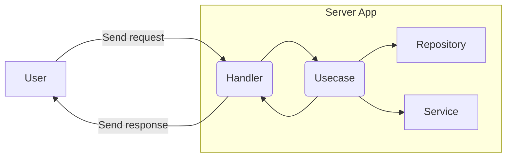

# Работа над проектом
## Необходимые инструменты
Перед началом работы необходимо установить следующие инструменты
1. Go – [Инструкция](https://go.dev/doc/install)
2. Docker - [Инструкция](https://docs.docker.com/desktop/)

## Настройка окружения
Для удобства работы в проекте используется `Make`. 
1. Чтобы установить необходимые зависимости, выполните следующую команду:
```bash
make setup
```
2. Далее необходимо создать `.env` файл с переменными окружения:
```bash
cp .env.example .env
```
3. Для локального запуска приложения необходимо создать и запустить базу данных. После установки Docker выполните следующую команду:
```bash
docker compose up -d
```
Это запустит контейнер с базой данных, подробности можно будет увидеть в Docker Desktop.

4. В проекте используется генератор моделей openapi. Выполните следующую команду чтобы сгенерировать модели запросов и ответов для методов API:
```bash
make generate-api-models
```

## Внесение изменений и деплой
Собрать и запустить проект можно следующей командой:
```bash
make run
```
По умолчанию приложение запустится на порту `8080` и запросы можно отправлять на `http://localhost:8080`.

В проекте пока нет поддержки hot-realod, поэтому после внесения изменений необходимо запускать проект заного.

В проекте имеется lint, запускается командой:
```bash
make lint
```

Для того чтобы сделать деплой в прод, необходимо создать новый тэг и запушить изменения с тэгом в ветку `main`:
```bash
git tag -a v1.0.0 -m "My release notes"
```
```bash
git push origin main --tags
```
После этого в Github запустится пайплайн, который соберёт проект и задеплоит изменения в прод.

Production url:
```bash
https://athylps-api.tmphey.dev
```

# Архитектура и структура проекта
## Структура папок
Проект использует более-менее стандартную структуру папок для проектов на Go, ознакомится можно **[здесь](https://github.com/golang-standards/project-layout/blob/master/README_ru.md)**.

Краткий обзор:
```bash
- api/            # Описание апи по спецификации OpenAPI, используется для автогенерации моделей запросов и ответов, документации, может использоваться для генерации клиентов
- build/          # Файлы и скрипты, необходимые для сборки проекта. Сейчас там Dockerfile для сборки контейнера с приложением
- cmd/            # Точки входа в программу, например запуск апи сервера или запуск приложения по миграции данных
- internal/       # Основной код приложения
  - api/          # Сгенерированные файлы апи
  - app/          # Запуск приложения (сборка зависимостей, старт HTTP сервера)
  - config/       # Работа с конфигами, чтение переменных окружения
  - handlers/     # Обработчики запросов
  - services/     # Переиспользуемые сервисы, например работа с внешними апи
  - usecases/     # Сценарии использования приложения, содержат основную бизнес-логику
  - repositories/ # Функции для работы с базой данных
- migrations/     # Миграции базы данных
- pkg/            # Переиспользуемые независимые пакеты, которые, при необходимости, могут быть использованы в других проектах
```
## Из чего состоит фича и жизненный цикл запроса
Как всегда, у нас есть два ~стула~ способа организации файлов в проекте: по фичам или по зонам ответственности. 

По фичам:
```bash
- users/
  - handlers/
    - user_handler.go
  - repositories/
    - user_repository.go
...
```
По зонам ответственности:
```bash
- handlers/
  - user_handlers.go
  - product_handlers.go
- repositories/
  - user_repository.go
  - product_repository.go
```
Учитывая размер проекта, своебразные правила именования и импорта пакетов в Go, и принятое в Go стремление к простой файловой организации, был выбран способ разделения по зонам ответственности. 

### Обработчики запросов (handlers)
Большинство фичей начинаются с обработчика запроса (handler).

Обработчик запроса отвечает за парсинг входящих данных, их базовую валидацию и отправку ответа клиенту. 
Обычно мы имеем 1 обработчик на одну ручку/ендпоинт. 
В Go, обработчик запроса это простая функция, которая принимает 2 аргумента:
```go
func CreateUserRequestHandler(w http.ResponseWriter, r *http.Request) {
    ...
}
```
`http.ResponseWriter` – интерфейс для отправки ответа пользователю (типа OutputStream в джаве)

`http.Request` – объект запроса, содержащий заголовки, тело запроса и еще кое-какие параметры

(пакет `http` из стандартной библиотеки)

Почти всегда нам необходимо передать в обработчик какую-нибудь зависимость, будь то логгер или юзкейс для исполнения бизнес-логики. Это также делается с помощью простой функции, которая принимает нужные зависимости и возвращает обработчик:
```go
func CreateUserRequestHandler(logger *zap.Logger) http.HandlerFunc {
    return func (w http.ResponseWriter, r *http.Request) {
        // we can use logger here
    }
}
```
### Сценарии использования (usecases)
Конечно, в простых случаях, мы можем написать всю нашу логику в обработчиках запросов, но тогда мы эту логику не сможем нормально протестировать и переиспользовать в других местах (например представьте что формировать отчёт надо не только по http-запросу, но и по таймеру раз в сутки).

Для этого мы выделяем отдельную сущность – **Usecase**. 

Задача данной сущности – инкапсулировать в себе определенный сценарий использования системы и сделать так, чтобы этот сценарий можно было исполнять в любом месте. 
Примером сценария использования может быть получение списка подписок для конкретного пользователя. 

В теории, Usecase, как и Handler, можно выразить с помощью обычной функции, но чаще его структура немного сложнее. В данном проекте Usecase, это тип struct с полями-зависимостями и одним публичным методом, который принимает аргументы, необходимые для исполнения сценария.
```go
// Определяем тип нашего сценария и указываем позя-зависимости, необходимые для работы
type CreateUserUsecase struct {
    logger *zap.Logger
}

// По конвенции, пишем функцию-конструктор
func NewCreateUserUsecase(logger *zap.Logger) *CreateUserUsecase {
    return &CreateUserUsecase{
        logger: logger
    }
}

// Пишем метод, который собственно содержит логику сценария
func (usecase *CreateUserUsecase) Perform(userName string) User {
    // create user
    return User{}
}
```
### Сервисы и репозитории (services/repositories)
Сценарии использования редко содержать только лишь одну чистую бизнес-логику, чаще нам всё-таки надо что-нибудь прочитать/записать в базу или сходить в сторонний сервис или исполнить логику, переиспользованную в нескольких сценариях. 

`service` – переиспользуемый функционал, который не привязан к определенному сценарию использования системы. Примерами могул служить `EmailService`, `TelegramApiService` итд. 

`repository` – объект, определяющий доступные функции для работы с данными. Чаще (но не всегда) инкапсулирует работу с одной (или несколькими сильно связанными) таблицой/сущностью в БД. Примерами могут служить `UserRepository`, `SubscriptionRepository` итд.

Их определение в коде не отличается от определения сценариев использования.

Пример сервиса:
```go
// Определяем структуру с полями-зависимостями
type TelegramApiService struct {
    logger      *zap.Logger
    tgApiClient *tg.Api
}

// Канонический конструктор
func NewTelegramApiService(logger *zap.Logger, tgApiClient *tg.Api) *TelegramApiService {
    return &TelegramApiService{
        logger: logger,
        tgApiClient: tgApiClient
    }
}

// Методы
func (service *TelegramApiService) SendMessage(msg...) {}
```
Пример репозитория:
```go
type UserRepository struct {
    db *pgxpool.Pool // клиент для подключения к БД
}

func NewUserRepository(db *pgxpool.Pool) *UserRepository {
    return &UserRepository{
        db: db
    }
}

func (repo *UserRepository) GetUserByID(id string) (*User, error) {
    user, err := repo.db.Query("select * from users where id = $1", id)
    return user, err

}
```
### Жизненный цикл запроса (и фичи)
В сервеных приложениях большинство фичей начинаются с получения http-запроса и заканчиваются отправкой http-ответа.

Запросы не пересекаются между собой, в идеале не шарят память и работают абсолютно независимо.

Учитывая наши сущности, обработка запроса в нашей системе выглядит следующим образом:

1. Пользователь отправляет запрос и мы попадаем в обработчик запроса (Handler)
2. Обработчик запроса запускает сценарий использования (Usecase)
3. Сценарий использования выполняет нужную логику, идет в базу через репозиторий или вызывает сервис (использует оба типа зависимостей или ни одного)
4. Сценарий использования возвращает результат своей работы обратно в обработчик запроса
5. Обработчик запроса формирует и отправляет ответ обратно пользователю
6. Исполнение кода остановилось

## Важная заметка о работе с зависимостями и интерфейсами в Go
В независимости от языка, правилом хорошего тона является зависить от интерфейсов, а не от реализации. Go не является исключением, правда его интерфейсы работают не так как в Java/Kotlin.

Интерфейсы в Go реализуются __неявно__, т.е. для того чтобы тип имплементировал интерфейс, он должен объявить такие же методы как в интерфейсе и соответствие данному интерфейсу будет засчитано автоматически. Например:
```go
// file:a.go

// Обращаем внимание что имя интерфейса написано с маленькой буквы,
// значит он – приватный и его нельзя импортировать в другой пакет
type logger interface {
    WriteLog(msg string)
}

// Имеем функцию, которая в качестве аргумента принимает любой тип, который соответствует нашему интерфейсу
func AcceptLogger(l logger) {
    l.WriteLog("Hello")
}

// file:b.go

// В другом пакете создадим следующую структуру
type FileLogger struct {}

// И добавим ей метод с такой же сигнатурой, как и у приватного интерфейса logger из другого пакета
func (f *FileLoger) WriteLog(msg) {
    ...
}

// Поскольку интерфейсы реализуются неявно, мы можем в функцию AcceptLogger
// передать нашу структуру и компилятор будет доволен.
func main() {
    fl := FileLogger{}
    AcceptLogger(fl) // Не смотря на то что мы явно нигде не реализовали интерфейс, наша структура прошла т.к. сигнатуры совпали
}
```
Данная особенность приводит к следующему:

__*В Go интерфейсы объявляются на стороне использования, а не на стороне создания (как в Java)*__

Например, в Java/Kotlin мы создаем функцию, которая возвращает интерфейс, а внутри ссылается на какую-то реализацию:
```kotlin
interface Logger {
    fun log(msg: String)
}

fun buildLogger(): Logger {
    return FileLogger()
}
```
В Go, функции-конструкторы или провайдеры обычно возвращают именно реализацию, а интерфейс создается в том месте, где нужно принять какую-то зависимость. 

Вот здесь можно почитать подробнее: [Using interfaces in Go the right way](https://medium.com/@mbinjamil/using-interfaces-in-go-the-right-way-99384bc69d39)
## Пример добавления фичи
Рассмотрим на примере добавление простой фичи и заодно увидим в действии неявные интерфейсы. 

Фича будет отдавать рандомное число при запросе на `GET /random`.

1. Первым шагом нам необходимо добавить нашу ручку в спеке `api/openapi.yaml`
2. После описания ручки в спеке необходимо сгенерировать новые модели
```bash
make generate-api-models
```
3. Далее мы создадим пока что пустой handler и добавим путь запроса в роутер
```go
// file: handlers/get_random.go
import "http"

func GetRandomHandler() http.HandlerFunc {
    return func(w http.ResponseWriter, r *http.Request) {
        w.Write([]byte("ok"))
    }
}
```
```go
// file: app/app.go

//...
r.Get("/random", handlers.GetRandomHandler())
//...
```
После данных манипуляций можно запустить приложение и сделать запрос, мы должны получить ответ `ok`.

4. Немного изменим наш handler и сделаем так, чтобы он принимал на вход usecase, который будет генерировать рандомное число
```go
// file: handlers/get_random.go
import (
    "http"
    "fmt"
    "json"
    "athylps/internal/api"
)

// Описываем интерфейс нашей зависимости, с маленькой буквы, он будет приватным
type randomUsecase interface {
    GetRandomInt() int
}

// Говорим что мы примем на вход любой тип, у которого будет метод GetRandomInt()
func GetRandomHandler(u randomUsecase) http.HandlerFunc {
    return func(w http.ResponseWriter, r *http.Request) {
        random := u.GetRandomInt()
        resp := api.GetRandomResponse{ //Модель, сгенерированная openapi
            random: random
        }
        _ = json.NewEncoder(w).Encode(resp)
    }
}
```
5. Необходимо создать Usecase и передать его в аргументы handler
```go
// file: usecases/get_random_usecase.go
type GetRandomUsecase struct {
}

func NewGetRandomUsecase() *GetRandomUsecase {
    return &GetRandomUsecase{}
}

func (u *GetRandomUsecase) GetRandomInt() int {
    return 42
}
```
```go
// file: app/app.go
// ...
randomUsecase := usecases.NewGetRandomUsecase()
r.Get("/random", handlers.GetRandomHandler(randomUsecase))
// ...
```
После данных манипуляций запрос
```bash
curl http://localhost:8080/random
```
должен заработать и вернуть наше заветное число.
# Инфраструктура
TODO